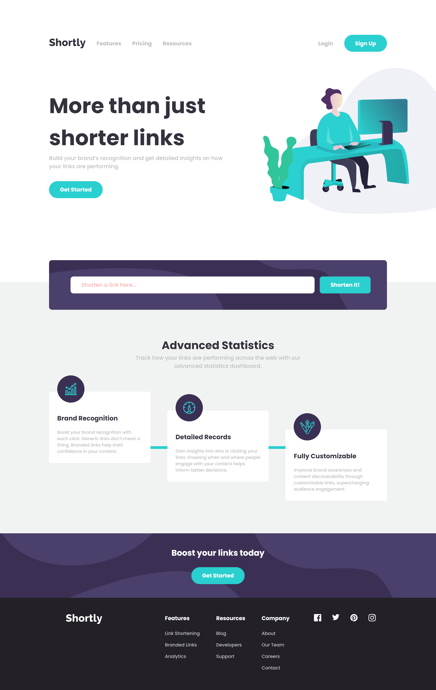

# Frontend Mentor - Shortly URL shortening API Challenge solution

This is a solution to the [Shortly URL shortening API Challenge challenge on Frontend Mentor](https://www.frontendmentor.io/challenges/url-shortening-api-landing-page-2ce3ob-G). Frontend Mentor challenges help you improve your coding skills by building realistic projects.

This project was bootstrapped with [Create React App](https://github.com/facebook/create-react-app).

## Table of contents

- [Overview](#overview)
  - [The challenge](#the-challenge)
  - [Screenshot](#screenshot)
  - [Links](#links)
  - [Prerequisites](#prerequisites)
  - [Installation](#installation)
- [My process](#my-process)
  - [Built with](#built-with)
  - [What I learned](#what-i-learned)
  - [Continued development](#continued-development)
  - [Useful resources](#useful-resources)
- [Author](#author)

## Overview

### The challenge

Users should be able to:

- View the optimal layout for the site depending on their device's screen size
- Shorten any valid URL
- See a list of their shortened links, even after refreshing the browser
- Copy the shortened link to their clipboard in a single click
- Receive an error message when the `form` is submitted if:
  - The `input` field is empty

### Screenshot

### Links

- Solution URL: [https://github.com/monika-drozdz/url-shortening-api](https://github.com/monika-drozdz/url-shortening-api)
- Live Site URL: [https://monika-drozdz.github.io/url-shortening-api/](https://monika-drozdz.github.io/url-shortening-api/)

### Prerequisites

An adequate version of Node.js is installed. Here's the adequate version I use:

`$ node --version`
`v12.1.0`

An adequate version of npm is installed. Here's the adequate version I use:

`$ npm --version`
`6.9.0`

### Installation

Installation:

`npm install`

To Run Test Suite:

`npm test`

To Start Server:

`npm start`

To Visit App:

Open [http://localhost:3000](http://localhost:3000) to view it in the browser.

## My process

### Built with

- Semantic HTML5 markup
- Flexbox
- [SASS](https://sass-lang.com/)
- Mobile-first workflow
- [React](https://reactjs.org/) - JS library
- React Hooks

### What I learned

- Fetching data from an external API
- React Hooks such as useState, useRef, useEffect

### Continued development

Use this section to outline areas that you want to continue focusing on in future projects. These could be concepts you're still not completely comfortable with or techniques you found useful that you want to refine and perfect.

### Useful resources

- [Three dots-loading effect](https://codepen.io/AnoNewb/pen/JwypRN) - I used this to create Spinner component

## Author

- GitHub - [@monika-drozdz](https://github.com/monika-drozdz)
- Frontend Mentor - [@monika-drozdz](https://www.frontendmentor.io/profile/monika-drozdz)
- Linkedin - [@monika-drozdz](https://www.linkedin.com/in/monika-dróżdż)
